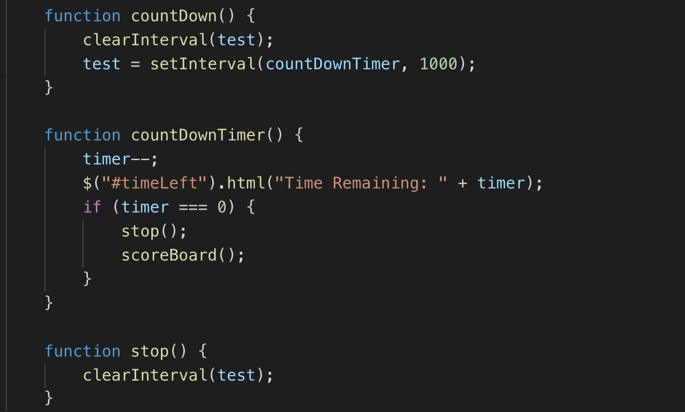

# TriviaGame

I built a trivia game using JavaScript and jQuery. The instructions are below along with a GIF. 

## Live Link

https://shelbyreins.github.io/TriviaGame/

## Description on how to use:

- Press the start button
- You will be given 10 questions with 3 answers
- You will have 60 seconds to answer all the questions
- Read the questions and answer to the best of your ability, you can only select one answer per question
- If you finish before the timer, press submit and your score will populate
- If you run out of time your score will automatically populate
- Have fun!

    

### Game Design Notes

- User will have limited time to complete the quiz
- User can only select one answer per question
- Must contian a count down timer

 ## Technologies Used

- HTML
- CSS
- Git
- Github
- JavaScript
- jQuery
- setInterval

    ### Code Snippet
    This code illistrates the timer. The timer goes down by one second at a time for a total of 60 seconds. If the timer reaches zero seconds, the timer will stop and populate the players score. 

    
